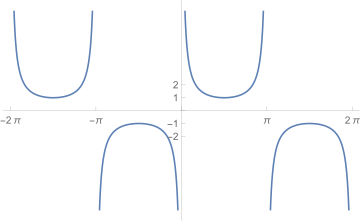

# 高等数学  
-----

## 微积分  

### 函数、极限与连续  

#### 函数的概念及表示法  
> *设非空数集 A 、 B ，法则 f 。若在 f 的作用下， A 中任意元素 x 在 B 中都有唯一元素 y 与之对应，则法则 f 是集合 A 到集合 B 的一个函数。记 y = f(x), x ∈ A 。其中 x 叫自变量， y 叫因变量。*  

由此可见，当两个函数的 `定义域` 和 `法则` 都相同时，两函数为相同函数。  

#### 函数的简单性质  
1. 奇偶性  
> *设函数 y = f(x) 的定义域为 D ，若对于任意的 x ∈ D ，总有 f(-x) = -f(x) ，则 f(x) 为奇函数；总有 f(-x) = f(x) ，则 f(x) 为偶函数。*  

由此可见，奇函数图像关于坐标原点对称，偶函数图像关于 y 轴对称，奇偶函数的定义域关于原点对称。  

2. 有界性  
> *设函数 y = f(x) 的定义域为 D ，若存在正数 M > 0，对于任意的 x ∈ D ，都有 |f(x)| ≤ M ，则 y = f(x) 为有界函数。*  

由此可见，有界函数 y = f(x) 的图像介于两水平直线 y = -M 和 y = M 之间。  

3. 单调性  
> *设函数 y = f(x) 在区间 I 上有定义，若对于任意 x₁ ， x₂ ∈ I ，当 x₁ < x₂ 时，总有 f(x₁) < f(x₂) ，则 y = f(x) 在区间 I 上为单调增函数；总有 f(x₁) > f(x₂) ，则 y = f(x) 在区间 I 上为单调减函数。*  

4. 周期性  
> **  

#### 函数极限的定义及性质   
> *$ x\to \infty $ 时， f(x) 的极限记作 $ \lim_{x \to \infty} f(x) $ 。*
> *研究 $ \lim_{x \to \infty} f(x) $ 就是研究当 |x| 无限增大时， f(x) 的值的变化趋势。*
> *当 |x| 无限增大时， |f(x)| 也无限增大，记作 $ \lim_{x \to \infty} f(x) = \infty $ 。*
> *当 |x| 无限增大时， |f(x)| 也无限趋近于某一确定的常数 A ，记作 $ \lim_{x \to \infty} f(x) = A $ 。*
> *当 |x| 无限增大时， |f(x)| 的值没有确定的变化趋势 ，则称 $ \lim_{x \to \infty} f(x) $ 不存在。*
> 
> *$ x\to x_{0} $ 时， f(x) 的极限记作 $ \lim_{x \to x_{0}} f(x) $ 。*
> *研究 $ \lim_{x \to x_{0}} f(x) $ 就是研究当 x 无限趋近于 x₀ 时， f(x) 的值的变化趋势。*
> *当 x 无限趋近于 x₀ 时， |f(x)| 无限增大，记作 $ \lim_{x \to x_{0}} f(x) = \infty $ 。*
> *当 x 无限趋近于 x₀ 时， |f(x)| 无限趋近于某一确定的常数 A ，记作 $ \lim_{x \to x_{0}} f(x) = A $ 。*
> *当 x 无限趋近于 x₀ 时， |f(x)| 的值没有确定的变化趋势 ，则称 $ \lim_{x \to x_{0}} f(x) $ 不存在。*

#### 函数的左极限和右极限  
> *左极限 $ \lim_{x \to x_{0}^-} f(x) $就是研究当 x 从小于 x₀ 的方向无限趋近于 x₀ 时，  f(x) 的值的变化趋势。*
> *右极限 $ \lim_{x \to x_{0}^+} f(x) $就是研究当 x 从大于 x₀ 的方向无限趋近于 x₀ 时，  f(x) 的值的变化趋势。*
> 
> 函数极限 $ \lim_{x \to x_{0}} f(x) = A $ 的充分必要条件：
> $ \lim_{x \to x_{0}} f(x) = A \Leftrightarrow \lim_{x \to x_{0}^-} f(x) = A 且 \lim_{x \to x_{0}^+} f(x) = A $
> 
> 函数极限 $ \lim_{x \to x_{0}} f(x) $ 存在的充分必要条件：
> $ \lim_{x \to x_{0}} f(x) 存在 \Leftrightarrow \lim_{x \to x_{0}^-} f(x) 、 \lim_{x \to x_{0}^+} f(x) 存在且相等 $

#### 极限的四则运算  
> *设函数 f(x) ， g(x) ，若 $ \lim_{x \to x_{0}(\infty)} f(x) = A $ ， $ \lim_{x \to x_{0}(\infty)} g(x) = B $ 都存在，则：*
> $$
\begin{align}
    & \lim _{x \to x_{0}(\infty)} [f(x) \pm g(x)] = \lim _{x \to x_{0}(\infty)} f(x) \pm \lim _{x \to x_{0}(\infty)} g(x) = A \pm B \\\\
    & \lim _{x \to x_{0}(\infty)} f(x) \cdot g(x) = \lim _{x \to x_{0}(\infty)} f(x) \cdot \lim _{x \to x_{0}(\infty)} g(x) = A \cdot B \\\\
    & \lim _{x \to x_{0}(\infty)} K f(x) = K \lim _{x \to x_{0}(\infty)} f(x) = KA（其中K为常数） \\\\
    & 当 B \ne 0 时，\lim _{x \to x_{0}(\infty)} \frac {f(x)} {g(x)} = \frac {\lim _{x \to x_{0}(\infty)} f(x)} {\lim _{x \to x_{0}(\infty)} g(x)} = \frac {A} {B}  
\end{align}
> $$

#### 无穷小量和无穷大量的概念及其关系  
1. 无穷小量和无穷大量的概念  
> 无穷小量：若 $ \lim_{x \to x_{0}(\infty)} f(x) = 0 $ ，则称当 $ x \to x_{0}(\infty) $ 时， f(x) 是无穷小量。
> 无穷大量：若 $ \lim_{x \to x_{0}(\infty)} f(x) = \infty $ ，则称当 $ x \to x_{0}(\infty) $ 时， f(x) 是无穷大量。

2. 无穷小量和无穷大量的关系  
> 若 $ \lim_{x \to x_{0}(\infty)} f(x) = 0 $ ，且 f(x) ≠ 0 ，则 $ \lim_{x \to x_{0}(\infty)} \frac {1} {f(x)} = \infty $ 。
> 若 $ \lim_{x \to x_{0}(\infty)} f(x) = \infty $ ，则 $ \lim_{x \to x_{0}(\infty)} \frac {1} {f(x)} = 0 $ 。

#### 无穷小量的性质  
> 1. 无穷小量与有界函数的乘积仍是无穷小量。
> 2. 有限个无穷小量的和或积仍是无穷小量。

#### 无穷小量的比较  
> $$
\begin{array}{l}
    设 \lim _{x \to x_{0}(\infty)} \alpha(x) = 0, \lim _{x \to x_{0}(\infty)} \beta(x) = 0 ，若\\\\
    \lim _{x \to x_{0}(\infty)} \frac{\alpha(x)}{\beta(x)} = 0 , 则称当  x \to x_{0}(\infty)  时,  \alpha(x)  是比  \beta(x)  高阶的无穷小量。\\\\
    \lim _{x \to x_{0}(\infty)} \frac{\alpha(x)}{\beta(x)} = \infty , 则称当  x \to x_{0}(\infty)  时,  \alpha(x)  是比  \beta(x)  低阶的无穷小量。\\\\
    \lim _{x \to x_{0}(x)} \frac{\alpha(x)}{\beta(x)} = C, \quad(C \neq 0) , 则称当  x \to x_{0}(\infty)  时,  \alpha(x)  与  \beta(x)  是同阶的无穷小量。\\\\
    \lim _{x \to x_{0}(x)} \frac{\alpha(x)}{\beta(x)} = 1 , 则称当  x \to x_{0}(\infty)  时,  \alpha(x)  与  \beta(x)  是等价的无穷小量，记做  \alpha(x) \sim \beta(x) (x \to x_{0}(\infty)) 
\end{array}
> $$

运算表达式中，因式出现无穷小量可以用等价无穷小量代换。  

#### 常用的等价无穷小  
> $$
\begin{array}{l}
    当 u(x) \rightarrow 0 时 \\\    u(x) \sim \sin u(x) \sim \tan u(x) \sim \ln _{} [1+u(x)] \sim e^{u(x)}-1 \sim \arcsin u(x) \sim \arctan u(x) \\\\
    1-\cos u(x) \sim \frac{1}{2}[u(x)]^{2} \\\\
    [1+u(x)]^{\lambda}-1 \sim \lambda u(x) ， 特别地  \sqrt{1+u(x)}-1 \sim \frac{1}{2} u(x) \\\\
\end{array}
> $$

#### 求幂指函数的 “$1^{\infty }$” 型极限  
> $$
\begin{array}{l}
    \lim _{x \rightarrow \infty} \frac{a_{0} x^{m}+a_{1} x^{m-1}+\ldots+a_{m}}{b_{0} x^{n}+b_{1} x^{n-1}+\ldots+b_{n}}=\left\{\begin{array}{cc}
    0 & \text {, 当 } m<n \\
    \frac{a_{0}}{b_{0}} & \text {, 当 } m=n \\
    \infty & \text {, 当 } m>n
    \end{array}\right.\\\\
    重要极限\\
    \lim _{x \rightarrow x_{0}(\infty)}[1+u(x)]^{\frac{1}{u(x)}}=e \text {, 其中 } u(x) \rightarrow 0\\\\
    变形\\
    \lim _{x \rightarrow x_{0}(\infty)}[f(x)]^{\varphi(x)}=\lim _{x \rightarrow x_{0}(\infty)}[1+(f(x)-1)]^{\frac{1}{f(x)-1}\cdot[f(x)-1]\cdot \varphi(x)}=e^{[f(x)-1]\cdot \varphi(x)} \text {, 其中 } f(x) \rightarrow 1 ,\varphi(x) \rightarrow \infty\\
    若\lim _{x \rightarrow x_{0}(\infty)}[f(x)-1]\cdot \varphi(x)=A,则\lim _{x \rightarrow x_{0}(\infty)}[f(x)]^{\varphi(x)}=e^A
\end{array}
> $$

#### 洛必达法则求未定式 “$\frac {0} {0}$” “$\frac {\infty} {\infty}$” 型极限  
> $$
\begin{array}{l}
    设  \lim _{x \rightarrow x_{0}} f(x)=0(\infty),\lim _{x \rightarrow x_{0}} g(x)=0(\infty) \\
    f(x), g(x)  在  x=a  的某去心领域内可导, 且  g^{\prime}(x) \neq 0 \\
    如果  \lim _{x \rightarrow x_{0}} \frac{f^{\prime}(x)}{g^{\prime}(x)}=A(\infty) , 
    则  \lim _{x \rightarrow x_{0}} \frac{f(x)}{g(x)}=\lim _{x \rightarrow x_{0}} \frac{f^{\prime}(x)}{g^{\prime}(x)}=A(\infty)
\end{array}
> $$

#### 洛必达法则求未定式 “$\infty - \infty$” 型极限  
> $$
\begin{array}{l}
    "\infty - \infty"型未定式极限，可以通分化成"\frac{0}{0}"型极限后使用洛必达法则
\end{array}
> $$

#### 洛必达法则求未定式 “$0 \cdot \infty$” 型极限  
> $$
\begin{array}{l}
	"0 \cdot \infty"型未定式极限，可以将所求极限的函数由乘积的形式改写成商的形式，化成 "\frac {0} {0}" 或 "\frac {\infty} {\infty}" 型极限
\end{array}
> $$

#### 无穷小量与有界函数的乘积仍是无穷小量  

#### 利用左右极限求极限  
1. 求分段函数不同表达式分段点处的极限  
2. 求极限 $\lim _{x \rightarrow a} f(x)$ ，而表达式中含有 |x-a|  
3. 求指函数 $a^{f(x)}$ ，反正切函数 $arctan f(x)$ ，反余切函数 $arccot f(x)$ ，当 $f(x) \rightarrow \infty$ 时的极限  

#### 已知函数的极限，求函数表达式中的值  
> $$
\begin{array}{l}
    若已知 \lim _{x \rightarrow x_{0}} \frac{P(x)}{Q(x)}=A (A为常数) \\
    则由 \lim _{x \rightarrow x_{0}} Q(x)=0 可知 \lim _{x \rightarrow x_{0}} P(x)=0 \\
    当 A \neq 0 时, 由 \lim _{x \rightarrow x_{0}} P(x)=0 可知 \lim _{x \rightarrow x_{0}} Q(x)=0
\end{array}
> $$

#### 无穷小阶的比较  

#### 函数连续的定义  
> $$
\begin{array}{l}
    设函数  y=f(x)  在  x=x_{0}  的某邻域内有定义 \\
    若  \lim _{x \rightarrow x_{0}} f(x)=f\left(x_{0}\right) \\
    则称  f(x)  在  x=x_{0}  处连续 \\\\
    函数在一点  x=x_{0}  处连续的定义中包含了函数在  x=x_{0}  处连续的三个基本条件\\
    1. 极限  \lim _{x \rightarrow x_{0}} f(x)  存在 \\
    2. 函数值  f\left(x_{0}\right)  存在, 即  f(x)  在  x_{0}  处有定义 \\
    3. 极限值和函数值两者相等 \\\\
	初等函数在其定义区间内都是连续的
\end{array}
> $$

#### 函数左连续与右连续  
> $$
\begin{array}{l}
若  f\left(x_{0}-0\right)=\lim _{x \rightarrow x_{0}^{*}} f(x)=f\left(x_{0}\right) ，则称  f(x)  在  x=x_{0}  处左连续 \\
若  f\left(x_{0}+0\right)=\lim _{x \rightarrow x_{0}^{+}} f(x)=f\left(x_{0}\right) ，则称  f(x)  在  x=x_{0}  处右连续 \\
由此可知  f(x)  在  x=x_{0}  处连续  \Leftrightarrow f(x)  在  x=x_{0}  处左、右都连续，即  f\left(x_{0}-0\right)=f\left(x_{0}+0\right)=f\left(x_{0}\right) 
\end{array}
> $$

#### 函数的间断点及其分类  
1. 间断点的定义  
> 函数不连续点称为间断点  
> 函数无定义的孤立点必是间断点  
> 分段函数的分段点可能是间断点  

2. 间断点的分类  
> 以间断点处左、右极限是否都存在作为依据分为：第一类间断点、第二类间断点  
> - 第一类间断点：左右极限都存在的间断点  
> 左极限 等于 右极限：可去间断点  
> 左极限 不等于 有极限：跳跃型间断点  
> - 第二类间断点：左右极限中至少有一个不存在的间断点  
> 左右极限中至少一个是无穷大：无穷型间断点  
> 趋近于间断点时无确定的变化趋势：振荡型间断点  

#### 闭区间上连续函数的性质  
1. 最大值、最小值定理  
> 若函数 f(x) 在闭区间 [a, b] 上连续，则 f(x) 在 [a, b] 上必取得最大值和最小值  

2. 介值定理  
> 若函数 f(x) 在闭区间 [a, b] 上连续，则 f(x) 必取得介于最大值和最小值之间的任意值  

3. 零点存在定理  
> 若函数 f(x) 在闭区间 [a, b] 上连续，且 f(a)*f(b)<0 ，则至少存在一点 x∈(a, b)，使 f(x)=0  

### 一元函数微分学  

#### 导数与微分的概念  
1. 导数的概念  
> $$
\begin{array}{l}
    设函数  y=f(x)  在点  x_{0}  的某邻域内有定义，\\
    如果极限  \lim _{\Delta x=0} \frac{f\left(x_{0}+\Delta x\right)-f\left(x_{0}\right)}{\Delta x}  存在，\\
    则称函数  f(x)  在点  x_{0}  处可导，\\
    并称此极限值为函数  f(x)  在点  x_{0}  的导数，记为  f^{\prime}\left(x_{0}\right)  或  \left.y^{\prime}\right|_{x=x_{0}}  或  \left.\frac{d y}{d x}\right|_{x-x_{0}}  。\\
    即  f^{\prime}\left(x_{0}\right)=\lim _{\Delta x-0} \frac{f\left(x_{0}+\Delta x\right)-f\left(x_{0}\right)}{\Delta x} \\\\
    在上述定义中, 若记  x_{0}+\Delta x=x , 则可得导数定义的另一等价形式: \\
    f^{\prime}\left(x_{0}\right)=\lim _{x=x_{0}} \frac{f(x)-f\left(x_{0}\right)}{x-x_{0}} \\\\
    如果函数  y=f(x)  在  (a, b)  内每一点都可导, 则称  f(x)  在  (a, b)  内可导
\end{array}
> $$

2. 左导数和右导数  
> $$
\begin{array}{l}
    左导数：\\
    设函数  y=f(x)  在点  x_{0}  的左邻域内有定义，\\
    如果极限\lim _{\Delta x \rightarrow 0^{-}} \frac{f\left(x_{0}+\Delta x\right)-f\left(x_{0}\right)}{\Delta x}  或  \lim _{x \rightarrow x_{0}^{-}} \frac{f(x)-f\left(x_{0}\right)}{x-x_{0}}  存在，\\
    则称此极限值为函数  f(x)  在点  x_{0}  处的左导数，记作  f_{-}^{\prime}\left(x_{0}\right)。\\
    即:  f_{-}^{\prime}\left(x_{0}\right)=\lim _{x \rightarrow x_{0}^{-}} \frac{f(x)-f\left(x_{0}\right)}{x-x_{0}} \stackrel{\text { 或 }}{=} \lim _{\Delta x \rightarrow 0^{-}} \frac{f\left(x_{0}+\Delta x\right)-f\left(x_{0}\right)}{\Delta x} \\\\
    右导数：\\
    设函数  y=f(x)  在点  x_{0}  的右邻域内有定义，\\
    如果极限\lim _{\Delta x \rightarrow 0^{+}} \frac{f\left(x_{0}+\Delta x\right)-f\left(x_{0}\right)}{\Delta x}  或  \lim _{x \rightarrow x_{0}^{+}} \frac{f(x)-f\left(x_{0}\right)}{x-x_{0}}  存在，\\
    则称此极限值为函数  f(x)  在点  x_{0}  处的右导数，记作  f_{+}^{\prime}\left(x_{0}\right)。\\
    即:  f_{+}^{\prime}\left(x_{0}\right)=\lim _{x \rightarrow x_{0}^{+}} \frac{f(x)-f\left(x_{0}\right)}{x-x_{0}} \stackrel{\text { 或 }}{=} \lim _{\Delta x \rightarrow 0^{+}} \frac{f\left(x_{0}+\Delta x\right)-f\left(x_{0}\right)}{\Delta x} 
\end{array}
> $$

3. 函数的可导性与连续性之间的关系  
> $$
\begin{array}{l}
    f(x) \text { 在点 } x_{0} \text { 处可导 } \Rightarrow f(x) \text { 在点 } x_{0} \text { 处连续 } \Rightarrow \text { 极限 } \lim f(x) \text { 存在 }
\end{array}
> $$

4. 导数的几何意义  
> $$
\begin{array}{l}
    f^{\prime}\left(x_{0}\right)  是曲线  y=f(x)  上点  \left(x_{0}, f\left(x_{0}\right)\right)  处的切线斜率 \\
    由此可见, 曲线  y=f(x)  上点  \left(x_{0}, f\left(x_{0}\right)\right)  处 \\
    切线方程为:  y-f\left(x_{0}\right)=f^{\prime}\left(x_{0}\right)\left(x-x_{0}\right) \\
    法线方程为:  y-f\left(x_{0}\right)=\frac{-1}{f\left(x_{0}\right)}\left(x-x_{0}\right) \\
\end{array}
> $$

5. 函数的微分  
> $$
\begin{array}{l}
    函数  f(x)  在点  x  处可微的充分必要条件是函数  f(x)  在点  x  处可导。\\
    且当  f(x)  在点  x  处可微时，其微分必是:  d y=f^{\prime}(x) d x 
\end{array}
> $$

6. 导数的定义求极限  
> $$
\begin{array}{l}
    当  f(x)  在  x=x_{0}  处可导时 \\
    \lim _{\Delta x \rightarrow 0} \frac{f\left(x_{0}+\alpha \Delta x\right)-f\left(x_{0}+\beta \Delta x\right)}{\Delta x}=(\alpha-\beta) f^{\prime}\left(x_{0}\right)
\end{array}
> $$

#### 导数和微分的求法  
1. 求导公式  
> $$
\begin{array}{l}
	幂函数：\\
	(c)^{\prime}=0 \\
    \left(x^{\mu}\right)^{\prime}=\mu x^{\mu-1} \\
    \left(\frac{1}{x}\right)^{\prime}=-\frac{1}{x^{2}} \\
    (\sqrt{x})^{\prime}=\frac{1}{2 \sqrt{x}} \\\\
    指数/对数函数：\\
    \left(a^{x}\right)^{\prime}=a^{x} \ln a \\
    \left(e^{x}\right)^{\prime}=e^{x} \\
    \left(\log _{a} x\right)^{\prime}=\frac{1}{x \ln a} \\
    (\ln x)^{\prime}=\frac{1}{x} \\\\
    三角函数：\\
    (\sin x)^{\prime}=\cos x \\ 
    (\cos x)^{\prime}=-\sin x \\
    (\tan x)^{\prime}=\sec ^{2} x \\
    (\cot x)^{\prime}=-\csc ^{2} x \\
    (\sec x)^{\prime}=\sec x \tan x \\
    (\csc x)^{\prime}=-\csc x \cot x \\\\
    反三角函数：\\
    (\arcsin x)^{\prime}=\frac{1}{\sqrt{1-x^{2}}} \\
    (\arccos x)^{\prime}=-\frac{1}{\sqrt{1-x^{2}}} \\
    (\arctan x)^{\prime}=\frac{1}{1+x^{2}} \\
    (\operatorname{arccot} x)^{\prime}=-\frac{1}{1+x^{2}} 
\end{array}
> $$

2. 函数的四则运算求导法则  
> $$
\begin{array}{l}
    设  u=u(x)，v=v(x)  均为可导函数, 则有 \\
    (u \pm v)^{\prime}=u^{\prime} \pm v^{\prime} \\
    (u v)^{\prime}=u^{\prime} v+u v^{\prime}  推广  \left\{\begin{array}{c}(u v w)^{\prime}=u^{\prime} v w+u v^{\prime} w+u v w^{\prime} \\ (k u)^{\prime}=k u^{\prime}\end{array}\right.  (  k  为常数) \\
    当  v \neq 0  时， \left(\frac{u}{v}\right)^{\prime}=\frac{u^{\prime} v-u v^{\prime}}{v^{2}} 
\end{array}
> $$

3. 复合函数求导法则  
> $$
\begin{array}{l}
    设  u=\varphi(x)  在点  x  处可导， y=f(u)  在对应点  u  处也可导，\\
    则复合函数  y=f[\varphi(x)]  在点  x  处可导，\\
    且  \frac{d y}{d x}=\frac{d y}{d u} \cdot \frac{d u}{d x}=f^{\prime}(u) \cdot \varphi^{\prime}(x)=f^{\prime}[\varphi(x)] \cdot \varphi^{\prime}(x) 
\end{array}
> $$

4. 函数微分的求法  
> $$
\begin{array}{l}
    由 y = f(x) 求出导数 y^{\prime}，则微分 dy = y^{\prime}dx
\end{array}
> $$

5. 幂指函数导数的求法  
> $$
\begin{array}{l}
    先换底，再求导 \\
    y=[f(x)]^{\varphi(x)}=e^{\varphi(x) \ln f(x)}
\end{array}
> $$

6. 分段函数导数的求法  
> 非分段点处按求导法则求导，分段点处按导数定义求导

7. 由参数方程确定的函数导数的求法  
> $$
\begin{array}{l}
    设函数  y=y(x)  由参数方程  \left\{\begin{array}{l}x=f(t) \\ y=\varphi(t)\end{array}\right.  所确定, 求  \frac{d y}{d x} \\\\
    x=f(t)  两边对  t  求导, 得  \frac{d x}{d t}=f^{\prime}(t) \\
    y=\varphi(t)  两边对  t  求导, 得  \frac{d y}{d t}=\varphi^{\prime}(t) \\
    则  \frac{d y}{d x}=\frac{\frac{d y}{d t}}{\frac{d x}{d t}}=\frac{\varphi^{\prime}(t)}{f^{\prime}(t)} 
\end{array}
> $$

8. 隐函数导数的求法  
> $$
\begin{array}{l}
    由方程  F(x, y)=0  确定  y  为  x  的函数, 求  \frac{d y}{d x} \\\\
    方程两边对  x  求导, 因  y  是  x  的函数, 所以按复合函数求导法则, 对含有  y  的项求导时, 求导后该项还要乘以  y^{\prime}  。\\
    方程对  x  求导后, 得一含有  y^{\prime}  的等式, 从中解出  y^{\prime} 
\end{array}
> $$

9. 混合形式函数导数的求法  

#### 高阶导数  
1. 高阶导数的概念  
> $$
\begin{array}{l}
    设函数  y=f(x)  的导数  f^{\prime}(x)  仍可导, \\
    则  f^{\prime}(x)  的导数  \left[f^{\prime}(x)\right]^{\prime}  称为函数  y=f(x)  的二阶导数, \\
    记作  y^{\prime \prime}  或  f^{\prime \prime}(x)  或  \frac{d^{2} y}{d x^{2}}  。即  y^{\prime \prime}=\left(y^{\prime}\right)^{\prime}=\frac{d}{d x}\left(\frac{d y}{d x}\right) \\\\
    若二阶导数  y^{\prime \prime}  的导数  \left[y^{\prime \prime}\right]  ' 存在, \\
    则称  \left[y^{\prime \prime}\right]  ' 为  y=f(x)  的三阶导数, \\
    记作  y^{\prime \prime \prime}  或  f^{\prime \prime}(x)  或  \frac{d^{3} y}{d x^{3}} \\\\
    一般地, 若  y=f(x)  的  n-1  阶导数存在且仍可导, \\
    则称函数  y=f(x)  的  n-1  阶导数的导数为  y=f(x)  的  n  阶导数, \\
    记作  y^{(n)}  或  f_{(x)}^{(n)}  或  \frac{d^{n} y}{d x^{n}} 
\end{array}
> $$

2. 高阶导数的求法  
> 当所求导数的阶数不高时，可直接反复求导到指定阶数。
> 当所求导数的阶级较高或求 $y^{(n)}$ 的一般表达式，可先求若干阶导数，总结规律，从而写出 $y^{(n)}$ 的表达式。

3. 常用高阶导数  
> $$
\begin{array}{l}
    {[\sin (a x+b)]^{(n)}=a^{n} \sin \left(a x+b+n \cdot \frac{\pi}{2}\right)} \\
    {[\cos (a x+b)]^{(n)}=a^{n} \cos \left(a x+b+n \cdot \frac{\pi}{2}\right)} \\
    {\left[\frac{1}{a x \pm b}\right]^{(n)}=\frac{(-1)^{n} \cdot n ! \cdot a^{n}}{(a x \pm b)^{n+1}}}
\end{array}
> $$

4. 求参数方程所确定函数的二阶导数  
> $$
\begin{array}{l}
    设函数  y=y(x)  由参数方程  \left\{\begin{array}{l}x=f(t) \\ y=\varphi(t)\end{array}\right.  所确定, 求  \frac{d^{2} y}{d x^{2}} \\\\
    由  x=f(t)  两边对  t  求导, 得  \frac{d x}{d t}=f^{\prime}(t) \\
    由  y=\varphi(t)  两边对  t  求导, 得  \frac{d y}{d t}=\varphi^{\prime}(t) \\
    则  \frac{d y}{d x}=\frac{\frac{d y}{d t}}{\frac{d x}{d t}} \\
     \frac{d^{2} y}{d x^{2}}=\left(\frac{d y}{d x}\right)_{t}^{\prime} \cdot \frac{1}{\frac{d x}{d t}} 
\end{array}
> $$

5. 求隐函数的二阶导数  
> $$
\begin{array}{l}
    A类. 设函数  y=y(x)  由方程  F(x, y)=0  所确定, 求  \frac{d^{2} y}{d x^{2}} \\\\
    方程两边对  x  求导得 (1) 式。(注意其中的  y  是  x  的函数, 故当对含  y  的项求导时, 求导后要乘以  y^{\prime} ) \\
    (1) 式两边再对  x  求导得 (2) 式。(注意其中的  y  是  x  的函数, 故当对含  y  的项求导时, 求导后要乘以  y^{\prime}  ) \\
    由 (2) 式解出  \mathrm{y}^{\prime \prime} 。 (注意其中所含有的  y^{\prime}  要用 (1) 式中解出的  y^{\prime}  的表达式代入) \\\\
    B类. 设函数  y=y(x)  由方程  F(x, y)=0  所确定, 求  y^{\prime \prime}(a) \\\\
	用  A  类中方法求得 (1) 式和 (2) 式 \\
	将  x=a  代入原方程  F(x, y)=0 , 求出对应的  y  值  y=b , 将  x=a, y=b  代入 (1) 式中, 求出  y^{\prime}(a)  的值 \\
	将  x=a, y=b  及  y^{\prime}(a)  的值代入 (2) 式中, 求出  y^{\prime \prime}(a)  的值
\end{array}
> $$

#### 微分中值定理  
1. 罗尔定理  
> 如果函数 f(x) 满足条件
> 1. f(x) 在闭区间 [a, b] 上连续  
> 2. f(x) 在开区间 (a, b) 内可导  
> 3. f(a) = f(b)  
> 
> 则至少存在一点 $\xi$ ∈ (a, b) 使 $f^{\prime}(\xi)$ = 0  
> 由导数的几何意义可知：如果函数 f(x) 满足罗尔定理的三个条件，则曲线 y = f(x) 至少有一条水平切线。  

2. 拉格朗日定理  
> 如果函数 f(x) 满足条件
> 1. f(x) 在闭区间 [a, b] 上连续  
> 2. f(x) 在开区间 (a, b) 内可导  
> 
> 则至少存在一点 $\xi$ ∈ (a, b) 使 $\frac{f(b)-f(a)}{b-a}=f^{\prime}(\xi)$ 或 $f(b)-f(a)=(b-a) f^{\prime}(\xi)$   
> 由导数的几何意义可知：如果函数 f(x) 满足拉格朗日定理的两个条件，则曲线 y = f(x) 至少存在一条切线平行于连接曲线 y = f(x) 上两点 A(a, f(a)) 和 B(b, f(b)) 的直线。  
> 推论：如果在区间 I 上，$f^{\prime}(x)$ 恒为零，则函数 f(x) 在区间 I 上是一个数。  

#### 导数的应用  
1. 求曲线 y = f(x) 的切线方程  
> $$
\begin{array}{l}
	曲线  y=f(x)  上点  \left(x_{0}, f\left(x_{0}\right)\right)  处的切线斜率为  K_{\text {切 }}=f^{\prime}\left(x_{0}\right) \\\\
	切点  \left(x_{0}, f\left(x_{0}\right)\right)  已知, 求切线方程 \\
	(1) 求出切点处的导数值  f^{\prime}\left(x_{0}\right)  (此即为该点处的切线斜率) \\
	(2) 代入直线的点斜式方程, 即得所求的切线方程  y-f\left(x_{0}\right)=f^{\prime}\left(x_{0}\right)\left(x-x_{0}\right) \\\\
	切点未知, 求曲线  y=f(x)  满足某条件的切线方程 \\
	(1) 设切点为  (a, f(a)) \\
    (2) 写出切线方程的形式  y-f(a)=f^{\prime}(a)(x-a) \\
    (3) 根据切线所䒽足的条件求出  a  的值, 即得所求的切线方程
\end{array}
> $$

2. 求函数 y = f(x) 的单调区间，极值及在闭区间 [a, b] 上的最值  
> $$
\begin{array}{l}
    若在区间  (a, b)  内  f^{\prime}(x)>0 , 则在  (a, b)  内函数  y=f(x)  是单调递增的; \\
    若在区间  (a, b)  内  f^{\prime}(x)<0 , 则在  (a, b)  内函数  y=f(x)  是单调递减的。\\\\
    求函数  y=f(x)  的单调区间、极值 \\
    (1) 确定函数  f(x)  的定义域 \\
    (2) 在  f(x)  的定义域内求出使  f^{\prime}(x)=0  的点 (称为驻点) 及  f^{\prime}(x)  不存在的点 \\
    (实际上是在求  f^{\prime}(x)>0  与  f^{\prime}(x)<0  的分界点)  x_{1}, x_{2}, \cdots, x_{k}  \\
    (3) 在  f(x)  的定义域内揷入上述各点, 将定义域分成若干小区间, 列表判断各小区间
    内  f^{\prime}(x)  的正负即得结果 \\\\
    求函数  f(x)  在闭区间  [a, b]  上的最大值、最小值 \\
    (1) 求出  f^{\prime}(x) , 并在  (a, b)  内求出使  f^{\prime}(x)=0  的点及  f^{\prime}(x)  不存在的点 (即求出  f(x)  所有的极值可疑点)  x_{1}, x_{2}, \cdots, x_{k} \\
    (2) 计算  f\left(x_{1}\right), f\left(x_{2}\right), \cdots, f\left(x_{k}\right)  及  f(a), f(b) \\
    (3)上述各函数值中最大（小）者即为所求的最大（小）值
\end{array}
> $$

3. 求曲线的凹凸区间、拐点  
> $$
\begin{array}{l}
	若在区间  (a, b)  内  f^{\prime \prime}(x)>0 , 则在  (a, b)  内曲线是凹的 \\
	若在区间  (a, b)  内  f^{\prime \prime}(x)<0 , 则在  (a, b)  内曲线是凸的 \\\\
	(1) 确定函数  f(x)  的定义域 \\
    (2) 求出  f^{\prime \prime}(x) , 并在  f(x)  的定义域内求出使  f^{\prime \prime}(x)=0  的点及  f^{\prime \prime}(x)  不存在的点 \\
    （实际上是在求  f^{\prime \prime}(x)>0  与  f^{\prime \prime}(x)<0  的分界点）  x_{1}, x_{2}, \cdots, x_{k} \\
    (3) 在  f(x)  的定义域内揷入上述各点, 将定义域分成若干小区间, 列表半定各小区间
    内  f^{\prime \prime}(x)  的正负即得结果
\end{array}
> $$

4. 求曲线的水平渐近线与垂直渐近线  
> 曲线 y=f(x) 渐近线的概念
> 当动点 P 沿曲线 y=f(x) 无限远离原点时，若动点 P 到某定直线 l 的距离趋于 0 ，
> 则此定直线称为曲线 y=f(x) 的渐近线
> 当渐近线是一条平行于 x 轴的直线时，此渐近线称为曲线  y=f(x) 的水平渐近线
> 当渐近线是一条垂直于 x 轴的直线时，此渐近线 称为曲线 y=f(x) 的垂直渐近线
> $$
\begin{array}{l}
	水平渐近线的求法: \\
	求极限  \lim _{x \rightarrow \infty} f(x) , 若  \lim _{x \rightarrow \infty} f(x)=A  (常数), 则  y=A  是曲线  y=f(x)  的水平渐近线, \\
	(必要时分左、右极限求, \\
	若  \lim _{x \rightarrow-\infty} f(x)=A  (常数) 或  \lim _{x \rightarrow+\infty} f(x)=A  (常数) , 则  y=A  是曲线  y=f(x)  的水平渐近线)\\\\
	垂直渐近线的求法: \\
    选取常数  a , 若  \lim _{x \rightarrow a} f(x)=\infty , 则  x=a  是曲线  y=f(x)  的垂直渐近线。\\
    (常数  a  的选取方法:  a  是  f(x)  定义域中开区间的有限值端点, 对于分式函数即为使分母为零的点)
\end{array}
> $$

#### 证明不等式  
1. 证明：当 a<x<b 时，$f(x) > \varphi(x)$ 型不等式  
> $$
\begin{array}{l}
	利用函数的单调性证明 \\
    (1) 作辅助函数, 令  F(x)=f(x)-\varphi(x) , 并求出使  F(x)=0  的点 \\
    (必有  F(a)=0  或  F(b)=0 , 若 在  (a, b)  内的不存在使  F(x)=0  的点, \\
    则以极限值为 0 的点代替, \\
    此时必有  \lim _{x \rightarrow a^{+}} F(x)=0  或  \lim _{x \rightarrow b^{-}} F(x)=0  ) \\
    (2) 求出  F^{\prime}(x) , 并求出使  F^{\prime}(x)=0  的点 (必有  F^{\prime}(a)=0  或  F^{\prime}(b)=0  ) \\
    (3) 求出  F^{\prime \prime}(x) , 并判定  F^{\prime \prime}(x)  在  (a, b)  内的正负 \\
    (4) 推理得不等式 \\\\
    若在  (a, b)  内已能确定  F^{\prime}(x)  的正负, 则可由此直接 推出所证的不等式成立 \\
	若无法确定  F^{\prime \prime}(x)  在  (a, b)  内的正负, 则在  (a, b)  内求出使  F^{\prime \prime}(x)=0  的点, \\
	并求出  F^{\prime \prime \prime}(x)  在  (a, b)  内的正负, 由此推出所 证的不等式成立
\end{array}
> $$

2. 证明：当 a<x<b 时，$f(x) \ge \varphi(x)$ 型不等式  
> $$
\begin{array}{l}
	利用最大值、最小值证明 \\
    (1) 作辅助函数, 令  F(x)=f(x)-\varphi(x) \\
    (2) 求出  F^{\prime}(x) 在 (a, b) 内的最小值（最小值必为0）即得证
\end{array}
> $$

3. 证明：当 $a \le x \le b$ 时，$f(x) \ge \varphi(x)$ 型不等式  
> $$
\begin{array}{l}
    (1) 作辅助函数, 令  F(x)=f(x)-\varphi(x) \\
    (2) 求出  F^{\prime}(x) 在闭区间 [a, b] 上的最小值即得证
\end{array}
> $$

### 一元函数积分学  

#### 原函数和不定积分  
1. 原函数与不定积分的概念  
> $$
\begin{array}{l}
	原函数：如果在区间 I 上 F^{\prime}(x)=f(x) , 则称在区间  I  上  F(x)  为  f(x)  的一个原函数。\\
	不定积分：f(x)  的原函数的全体称为 f(x) 的不定积分, 记做  \int f(x) d x 。\\
	由原函数和不定积分的定义立即可知, \\
	若  F(x)  是  f(x)  的一个原函数, 则有  F^{\prime}(x)=f(x) , 及  \int f(x) d x=F(x)+c
\end{array}
> $$

2. 不定积分的性质  
> $$
\begin{array}{l}
    \left[\int f(x) d x\right]  '  =f(x)  或  d \int f(x) d x=f(x) d x \\
    \int f^{\prime}(x) d x=f(x)+c  或  \int d f(x)=f(x)+c \\
    \int\left[f_{1}(x) \pm f_{2}(x) \pm \cdots \pm f_{k}(x)\right] d x=\int f_{1}(x) d x \pm \int f_{2}(x) d x \pm \cdots \int f_{k}(x) d x \\
    \int k f(x) d x=k \int f(x) d x \quad(k  为常数，k \neq 0) \\
\end{array}
> $$

3. 求解有关原函数、不定积分的概念  
> $$
\begin{array}{l}
	利用原函数与不定积 分得概念: 如果  F(x)  是  f(x)  的一个原函数, 则有 \\
	F^{\prime}(x)=f(x) \\
	\int f(x) d x=F(x)+c \\\\
	利用不定积分与求导的关系 \\
	\left[\int f(x) d x\right]^{\prime}=f(x) , 推广:  \left[\int f[\varphi(x)] d x\right]  '  =f[\varphi(x)] \\
	\int f^{\prime}(x) d x=f(x)+c , 推广:  \int f^{\prime}[\varphi(x)] d \varphi(x)=f[\varphi(x)]+c 
\end{array}
> $$

4. 基本积分公式  
> $$
\begin{array}{l}
    \int 1 d x=x+c \\
    \int {x}^{a} d x=\frac{1}{a+1} x^{a+1}+c(a \neq-1)  特别地  \int \frac{1}{\sqrt{x}} d x=2 \sqrt{x}+c, \int \frac{1}{x^{2}} d x=-\frac{1}{x}+c \\
    \int{\frac{1}{x}} d x=\ln |x|+c \\
    \int a^{x} d x=\frac{1}{\ln a} a^{x}+c， \int e^{x} d x=e^{x}+c \\
    \int \cos x d x=\sin x+c \\
    \int \sin x d x=-\cos x+c \\
    \int {\frac{1}{\cos ^{2} x}} d x=\int \sec ^{2} x d x=\tan x+c \\
    \int {\frac{1}{\sin ^{2} x}} d x=\int \csc ^{2} x d x=-\cot x+c \\
    \int {\sec x \tan x d x}=\sec x+c \\
    \int \csc x \cot x d x=-\csc x+c \\
    \int \frac{1}{\sqrt{a^{2}-x^{2}}} d x=\arcsin \frac{x}{a}+c \\
    \int \frac{1}{a^{2}+x^{2}} d x=\frac{1}{a} \arctan \frac{x}{a}+c
\end{array}
> $$

#### 积分的基本方法  
1. 直接积分法  
> 对被积函数进行恒等变形，化成可直接使用基本积分公式的形式，利用基本积分公式求出积分

2. 第一种换元积分法（凑微分法）  
> $$
\begin{array}{l}
    如果  \int f(x) d x=F(x)+c , 则  \int f[\varphi(x)] d \varphi(x)=F[\varphi(x)]+c \\
    即将基本积分公式中的  x  换成  x  的可导函数  \varphi(x) , 积分公式仍成立 \\\\
    利用微分知识, 将被积表达式中的  d x  部分湊成  d \varphi(x)  的形式, \\
    使原积分化成  \int f[\varphi(x)] d \varphi(x)  的形式, 以便使用基本积分公式。\\\\
    常用的凑微分公式：\\
    d x=\frac{1}{a} d(a x+b) \\
    x^{\alpha} d x=\frac{1}{\alpha+1} d x^{\alpha+1} \quad(\alpha \neq-1) \\
    特别地
    \left\{\begin{array}{l}x d x=\frac{1}{2} d x^{2} \\ x^{2} d x=\frac{1}{3} d x^{3} \\ \frac{1}{\sqrt{x}} d x=2 d \sqrt{x} \\ \frac{1}{x^{2}} d x=-d \frac{1}{x}\end{array}\right. \\
    \frac{1}{x} d x=d \ln x \\
    e^{x} d x=d e^{x} \\
    \sin x d x=-d \cos x, \cos x d x=d \sin x \\
    \frac{1}{\cos ^{2} x} d x=\sec ^{2} d x=d \tan x \\
    \frac{1}{\sin ^{2} x} d x=\csc ^{2} d x=-d \cot x \\
    \sec x \tan x d x=d \sec x, \csc x \cot x=-d \csc x \\
    \frac{1}{\sqrt{1-x^{2}}} d x=d \arcsin x=-d \arccos x \\
    \frac{1}{1+x^{2}} d x=d \arctan x=-d \operatorname{arccot} x 
\end{array}
> $$

3. 第二种换元积分法  
> $$
\begin{array}{l}
	对于含根式的不定积分, 用第二种换元积分法, 令  x=\varphi(t)  去根号是常用的积分方法 \\
	\text { 被积函数中含有 } \sqrt[n]{a x+b} \text { 作代换令 } \sqrt[n]{a x+b}=t \\
    \text { 被积函数中含有 } \sqrt{a^{2}-x^{2}} \text { 作代换令 } x=a \sin t \text { 此时 } \sqrt{a^{2}-x^{2}} = a \cos t\\
    \text { 被积函数中含有 } \sqrt{a^{2}+x^{2}} \text { 作代换令 } x=a \tan t \text { 此时 } \sqrt{a^{2}+x^{2}} = \frac{a}{\cos t}\\
    \text { 被积函数中含有 } \sqrt{x^{2}-a^{2}} \text { 作代换令 } x=a \sec t \text { 此时 } \sqrt{x^{2}-a^{2}} = a \tan t\\
\end{array}
> $$

4. 分部积分法  
> $$
\begin{array}{l}
	分部积分公式：\int u d v=u v-\int v d u \\
\end{array}
> $$
> 记住以下口诀, 对正确选择和使用分部积分法大有帮助。
> “反、对、幂、三、指, 两两相乘就分部, 排列在前选代  u , 其余部分是  d v  ”
> 其中的 “反” 指反三角函数, “对” 指对数函数, “幂” 指帛函数, “三” 指三角函数,
> “指” 指指数函数。排列的前后按反、对、帛、三、指的顺序确定。积分时, 先对选作  d v  的部分凑微分, 以明确  v  的表达式。
> 另如果被积函数中只含有反三角函数或只含有对数函数, 也应使用分部积分法积分。此时反 三角函数、对数函数应选作  u  。
> 如果被积函数中含抽象函数的导数  $f^{\prime}(x)$  或  $f^{\prime \prime}(x)$ , 则应使用分部积分法积分, 此时  $d v=f^{\prime}(x) d x=d f(x)$  或  $d v=f^{\prime \prime}(x) d x=d f^{\prime}(x)$ 

#### 定积分的性质与计算  
1. 定积分概念的有关问题  
> $$
\begin{array}{l}
	定积分  \int_{a}^{b} f(x) d x  是一个数。其值与被积函数  f(x)  有关, 与积分区间  [a, b]  有关。 \\
	与积分变量的记号无关, 即  \int_{a}^{b} f(x) d x=\int_{a}^{b} f(t) d t \\\\
	定积分  \int_{a}^{b} f(x) d x  的几何意义: \\
	定积分  \int_{a}^{b} f(x) d x  表示由曲线  y=f(x) , 直线  x=a, x=b  及  x  轴所围图形面积的代数和 \\
	（  x  轴上方部分为面积的正值,  x  轴下方部分为面积的负值） \\
	特别的, 当在  [a, b]  上  f(x) \geq 0  时,  \\
	\int_{a}^{3} f(x) d x  等于由曲线  y=f(x) , 直线  x=a, x=b  及  x  轴所 围成平面图形的面积。
\end{array}
> $$

2. 定积分的性质  
> $$
\begin{array}{l}
	等式性质 \\
	\int_{a}^{b}\left[f_{1}(x) \pm f_{2}(x) \pm \cdots \pm f_{k}(x)\right] d x=\int_{a}^{b} f_{1}(x) d x \pm \int_{a}^{b} f_{2}(x) d x \pm \cdots \pm \int_{a}^{b} f_{k}(x) d x \\
	\int_{a}^{b} k f(x) d x=k \int_{a}^{b} f(x) d x \quad(k  为常数  ) \\
	\int_{a}^{b} f(x) d x=-\int_{b}^{a} f(x) d x \quad \int_{a}^{a} f(x) d x=0 \\
	\int_{a}^{b} f(x) d x=\int_{a}^{c} f(x) d x+\int_{c}^{b} f(x) d x \\\\
	不等式性质 \\
	如果在  [a, b]  上  f(x) \geq 0(f(x) \leq 0) , 则  \int_{a}^{b} f(x) d x \geq 0\left(\int_{a}^{b} f(x) d x \leq 0\right) \\
    如果在  [a, b]  上  f(x) \geq \varphi(x) , 则  \int_{a}^{b} f(x) d x \geq \int_{a}^{b} \varphi(x) d x \\
    定积分的估值定理: \\
    如 果在  [a, b]  上  f(x)  的最大值为  M , 最小值为  m , 则  m(b-a) \leq \int_{a}^{b} f(x) d x \leq M(b-a) 
\end{array}
> $$

3. 积分上限函数的导数  
> $$
\begin{array}{l}
	\left[\int_{a}^{\varphi(x)} f(t) d t\right]^{\prime}=f[\varphi(x)] \cdot \varphi^{\prime}(x) \\
	\left[\int_{g(x)}^{b} f(t) d t\right]^{\prime}=-f[g(x)] \cdot g^{\prime}(x) \\
	\left[\int_{g(x)}^{\varphi(x)} f(t) d t\right]^{\prime}=f[\varphi(x)] \cdot \varphi^{\prime}(x)-f[g(x)] \cdot g^{\prime}(x)
\end{array}
> $$

### 多元函数微积分学  

### 无穷级数  

### 常微分方程  

## 线性代数  

### 行列式与矩阵  

### 向量与线性方程组  

## 预备知识及公式  

### 对数恒等式  
$$
\begin{align}
    & \log _{a} a^{N} = N \\\\
    & a^{\log _{a} N} = N \\\\
    & \log _{a} M N = \log _{a} M + \log _{a} N \\\\
    & \log _{a} \frac{M}{N} = \log _{a} M-\log _{a} N \\\\
    & \log _{a} M^{n} = n \log _{a} M \\\\
    & \log _{a} b = \frac{\log _{c} b}{\log _{c} a} \quad = \frac{1}{\log _{b} a} \\\\
    & \log _{a^{r}} M^{s} = \frac{s}{r} \log _{a} M
\end{align}
$$
### 三角函数  

#### 命名  
> *关于三角函数的中文命名仍没有一个很好的说法能自圆其说，在理解上甚至有说法上认为 `正割` 和 `余割` 命名颠倒。这里从网上找到一个比较便于记忆的说法。*
> *`正` 、 `余` 代表的并非 角正对的边 和 角相邻的边，而是在 角为锐角时 此 三角函数的变化 是否与 角度值的变化 正相关，如 `正弦` 对边 比 斜边 ，角度值越大， `正弦` 值越大；`余弦` 邻边 比 斜边 ，角度值越大， `余弦` 值越小。同理， `正割` 、 `余割` 也是如此。*

#### 正弦：sin / sine  
  

#### 余弦：cos / cosine  
  

#### 正切：tan / tangent  
  

#### 余切：cot / cotangent  
  

#### 正割：sec / secant  
  

#### 余割：csc / cosecant  
  

#### 规律  
  
1. 邻值规律：每个 倒三角 的 上面两个值的平方和 等于 下面一个值的平方。  
2. 间值规则：六边形 的 每个值 等于 与它相邻的两个值的积。  
3. 对值规则：六边形 的 每个值 与它对位的值 互为倒数。  

#### 两角和公式  
$$
\begin{align}
    & \sin (A+B) = \sin A \cos B+\cos A \sin B \\\\
    & \sin (A-B) = \sin A \cos B-\cos A \sin B \\\\
    & \cos (A+B) = \cos A \cos B-\sin A \sin B \\\\
    & \cos (A-B) = \cos A \cos B+\sin A \sin B \\\\
    & \tan (A+B) = \frac{\tan A+\tan B}{1-\tan A \tan B} \\\\
    & \tan (A-B) = \frac{\tan A-\tan B}{1+\tan A \tan B} \\\\
    & \cot (A+B) = \frac{\cot A \cot B-1}{\cot B+\cot A} \\\\
    & \cot (A-B) = \frac{\cot A \cot B+1}{\cot B-\cot A}
\end{align}
$$
#### 二倍角公式  
$$
\begin{align}
    & \sin 2 A = 2 \sin A \cdot \cos A \\\\
    & \cos 2 A = \cos ^{2} A-\sin ^{2} A = 2 \cos ^{2} A-1 = 1-2 \sin ^{2} A \\\\
    & \tan 2 A = \frac{2 \tan A}{1-\tan ^{2} A}
\end{align}
$$
#### 半角公式  
$$
\begin{align}
	& \sin \left(\frac{A}{2}\right) = \sqrt{\frac{1-\cos A}{2}} \\\\
	& \cos \left(\frac{A}{2}\right) = \sqrt{\frac{1+\cos A}{2}} \\\\
	& \tan \left(\frac{A}{2}\right) = \sqrt{\frac{1-\cos A}{1+\cos A}} \\\\
    & \cot \left(\frac{A}{2}\right) = \sqrt{\frac{1+\cos A}{1-\cos A}} \\\\
    & \tan \left(\frac{A}{2}\right) = \frac{1-\cos A}{\sin A}=\frac{\sin A}{1+\cos A}
\end{align}
$$

### 反三角函数  

#### 反正弦：arcsin  
  

#### 反余弦：arccos  
  

#### 反正切：arctan  
  

#### 反余切  

#### 反正割  

#### 反余割  